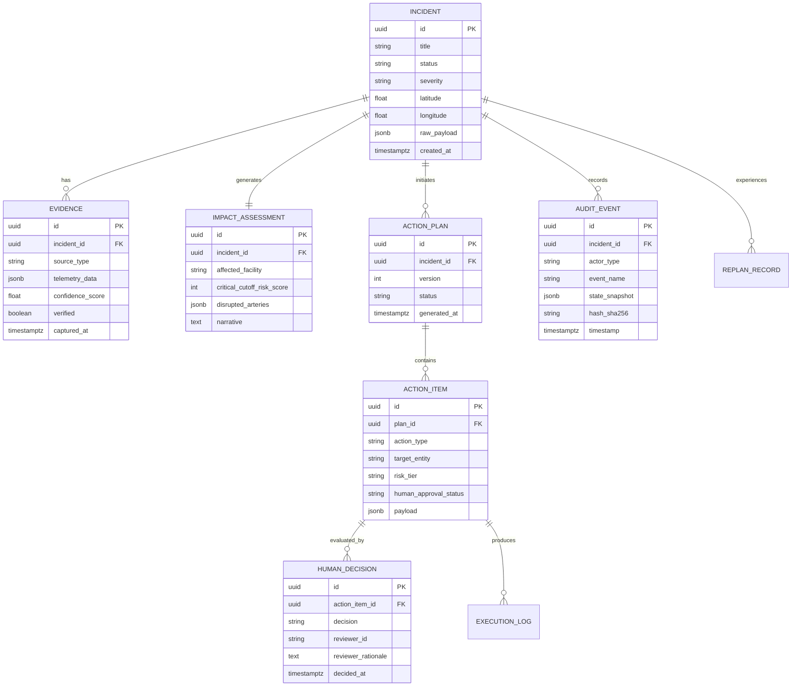

# NEXUS — Autonomous Real-World Response & Operations Network
## Comprehensive Project Specification

**Version:** 1.0.0  
**Target Event:** Ziro.digital National-Level Agentic AI Hackathon 2026  
**Primary Scenario:** Flooding Disrupts Access to a Critical Hospital  
**Classification:** Mission-Critical Agentic Operations Platform (Simulated Civil Infrastructure)

---

## 1. Product Vision

### 1.1 Executive Summary
When natural disasters or infrastructure failures strike urban centers, emergency operations centers (EOCs) face high cognitive load, fragmented communication channels, outdated static contingency manuals, and slow approval cycles. Critical minutes are lost validating whether roads are passable, locating specialized vehicles, routing ambulances around rising floodwaters, and coordinating civil authorities.

**NEXUS** is an autonomous, multimodal, multi-agent operations network designed to ingest real-world incident signals, cross-verify ground truth using diverse sensory evidence, compute multi-dimensional impact, synthesize actionable response plans, enforce deterministic human-in-the-loop (HITL) approval for high-risk actions, execute approved interventions against simulated operational systems, continuously monitor environmental changes, and dynamically replan when conditions evolve.

### 1.2 The One-Line Product Definition
> **A multimodal, multi-agent system that detects a real-world incident, verifies evidence, analyzes impact, plans a response, uses tools/APIs, requests human approval for risky actions, executes approved actions, monitors outcomes, and replans when conditions change.**

### 1.3 Core Engineering Philosophy & Non-Negotiables
1. **Not a Chatbot**: NEXUS is not a conversational assistant wearing an agent costume. It is a stateful, event-driven autonomous execution engine with explicit state transitions, typed graph edges, and deterministic safety barriers.
2. **Explicit Agent Responsibilities**: Every agent in the network has a narrow, formally specified charter, discrete inputs, bounded outputs, and isolated tool access.
3. **Structured State as the Single Source of Truth**: All reasoning artifacts, verification confidences, risk evaluations, and execution statuses are modeled as strictly typed schemas (Pydantic / TypedDict), not free-form markdown blobs.
4. **First-Class Tool Execution**: Tools are callable functions and HTTP endpoints with deterministic schemas, strict parameter validation, timeout budgets, and error fallbacks.
5. **Deterministic Safety Guardrails**: High-risk operational actions (e.g., closing main transit arteries, issuing civilian evacuation orders, rerouting ambulances away from trauma centers) **never** execute autonomously. They are intercepted by deterministic safety gates requiring explicit, authenticated human authorization.
6. **Safe Simulation Environment**: All downstream execution targets safe, simulated civil systems (dispatch simulators, dynamic message sign simulators, hospital bed management stubs) rather than production emergency infrastructure.
7. **Tamper-Evident Auditability**: Every prompt, completion, tool call, verification score, human approval, and actuator payload is immutably recorded with ISO-8601 timestamps and causality identifiers.
8. **Resilient Closed-Loop Control**: The system continuously polls environmental sensors post-execution and re-evaluates plan validity when changes exceed configured tolerance thresholds.

---

## 2. User Personas

### 2.1 Persona 1: Operations Commander (Elena Vance)
- **Role:** Municipal Emergency Operations Center (EOC) Watch Commander.
- **Pain Points:** 
  - Overwhelmed by duplicate, contradictory 911 calls and unverified social media alerts.
  - Lacks instant spatial awareness of which detour routes are physically passable for high-clearance emergency medical service (EMS) vehicles vs standard passenger vehicles.
  - Fears liability of automated AI systems executing unintended actions during disasters.
- **Goals:** 
  - Gain instant, verified situational awareness with evidence confidence scores.
  - Review clear, explainable action plans with explicit risk tags before granting authorization.
  - Monitor real-time execution status and receive proactive replanning alerts if floodwaters breach primary detours.

### 2.2 Persona 2: Logistics & Dispatch Coordinator (Marcus Chen)
- **Role:** Regional Emergency Medical Services & Public Works Dispatcher.
- **Pain Points:** 
  - Resource fragmentation across distinct databases (ambulances, portable water pumps, sandbag distribution depots, barrier crews).
  - Manual, error-prone phone coordination with field units during rapid environmental escalation.
- **Goals:** 
  - Automated resource discovery based on proximity, equipment specifications (e.g., vehicle axle clearance), and availability.
  - Instant dispatch packet generation with verified turn-by-turn safe waypoints once approved by the commander.

### 2.3 Persona 3: Civic Reporting Party / Automated Sensor Feeds
- **Role:** Citizen reporter on site or automated IoT stream (stream gauge sensor, municipal traffic camera).
- **Interface:** High-bandwidth, multimodal data payload (unstructured text description, smartphone photograph/video, geolocation coordinates, telemetry reading).
- **Goal:** Transmit ground-truth observations into the emergency system without requiring prior knowledge of dispatch protocols.

---

## 3. Primary Demonstration Scenario: Flooding Disrupts Hospital Access

### 3.1 Scenario Context
- **Incident Location:** Cross-streets of *Metropolitan Parkway* and *River Road*, directly flanking *St. Jude Memorial Hospital* (Level 1 Trauma Center).
- **Initial Event:** Severe cloudburst triggers flash flooding along the urban canal basin. Water surges across Metropolitan Parkway, submerging the primary ambulance ingress artery under 24–36 inches of fast-moving water.
- **Critical Risk:** Ambulances carrying critical emergency patients are unable to traverse Metropolitan Parkway; non-high-clearance vehicles risk hydrolocking; emergency room supply lines are paralyzed.

### 3.2 End-to-End 14-Step Operational Lifecycle

```
 ┌────────────────────────────────────────────────────────────────────────────────────────┐
 │                              1. INCIDENT INGESTION                                     │
 │  Citizen Report + Smartphone Photo + GPS Coordinates submitted via API/Portal          │
 └──────────────────────────────────────────┬─────────────────────────────────────────────┘
                                            ▼
 ┌────────────────────────────────────────────────────────────────────────────────────────┐
 │                             2. STRUCTURED EXTRACTION                                   │
 │  Perception Agent parses unstructured text & EXIF into typed IncidentRecord            │
 └──────────────────────────────────────────┬─────────────────────────────────────────────┘
                                            ▼
 ┌────────────────────────────────────────────────────────────────────────────────────────┐
 │                       3. MULTIMODAL EVIDENCE VERIFICATION                              │
 │  Verification Agent queries IoT Stream Gauges, Traffic Cameras & pgvector Incident DB  │
 └──────────────────────────────────────────┬─────────────────────────────────────────────┘
                                            ▼
 ┌────────────────────────────────────────────────────────────────────────────────────────┐
 │                              4. IMPACT ASSESSMENT                                      │
 │  Impact Agent determines hospital ingress cutoff, trauma triage disruption, road cuts  │
 └──────────────────────────────────────────┬─────────────────────────────────────────────┘
                                            ▼
 ┌────────────────────────────────────────────────────────────────────────────────────────┐
 │                              5. RESOURCE DISCOVERY                                     │
 │  Resource Agent queries fleet inventory: High-water rescue trucks, barrier units, pumps│
 └──────────────────────────────────────────┬─────────────────────────────────────────────┘
                                            ▼
 ┌────────────────────────────────────────────────────────────────────────────────────────┐
 │                           6. SAFE ROUTE CALCULATION                                    │
 │  Routing Engine computes topological bypass avoiding flooded nodes for EMS ingress     │
 └──────────────────────────────────────────┬─────────────────────────────────────────────┘
                                            ▼
 ┌────────────────────────────────────────────────────────────────────────────────────────┐
 │                             7. ACTION PLAN SYNTHESIS                                   │
 │  Planning Agent structures DAG of discrete actions: Signage, Dispatch, Diversion       │
 └──────────────────────────────────────────┬─────────────────────────────────────────────┘
                                            ▼
 ┌────────────────────────────────────────────────────────────────────────────────────────┐
 │                            8. DETERMINISTIC RISK SCORING                               │
 │  Safety Gate labels actions: TIER 1 (Automated) vs TIER 2/3 (Human Approval Required)  │
 └──────────────────────────────────────────┬─────────────────────────────────────────────┘
                                            ▼
 ┌────────────────────────────────────────────────────────────────────────────────────────┐
 │                          9. HUMAN-IN-THE-LOOP APPROVAL                                 │
 │  State Machine halts at AWAITING_APPROVAL; Watch Commander Elena Vance approves plan   │
 └──────────────────────────────────────────┬─────────────────────────────────────────────┘
                                            ▼
 ┌────────────────────────────────────────────────────────────────────────────────────────┐
 │                            10. SIMULATED TOOL EXECUTION                                │
 │  Execution Agent fires simulated municipal APIs (VMS signs, barrier dispatch, EMS alert│
 └──────────────────────────────────────────┬─────────────────────────────────────────────┘
                                            ▼
 ┌────────────────────────────────────────────────────────────────────────────────────────┐
 │                         11. ACTIVE SITUATION MONITORING                                │
 │  Monitoring Agent polls IoT stream gauge sensor at River Road every 10 seconds         │
 └──────────────────────────────────────────┬─────────────────────────────────────────────┘
                                            ▼
 ┌────────────────────────────────────────────────────────────────────────────────────────┐
 │                            12. SENSOR CHANGE DETECTION                                 │
 │  Gauge detects water surge (+18 inches) breaching Secondary Detour Route B             │
 └──────────────────────────────────────────┬─────────────────────────────────────────────┘
                                            ▼
 ┌────────────────────────────────────────────────────────────────────────────────────────┐
 │                            13. DYNAMIC REPLANNING LOOP                                 │
 │  State transitions back to Planning Agent: Route B invalidated, Route C calculated     │
 └──────────────────────────────────────────┬─────────────────────────────────────────────┘
                                            ▼
 ┌────────────────────────────────────────────────────────────────────────────────────────┐
 │                        14. AUDIT TRAIL & LOG RESIDUALS                                 │
 │  Complete execution DAG, prompt traces, decisions, and outcomes written to Audit DB    │
 └────────────────────────────────────────────────────────────────────────────────────────┘
```

---

## 4. System Architecture

### 4.1 Tiered Layering
1. **Perception & Ingestion Tier:** FastAPI endpoints accepting JSON and multipart form data (reports, image attachments, coordinates).
2. **Multi-Agent Orchestration Tier:** LangGraph state machine maintaining typed execution state, cyclical replanning loops, and deterministic checkpointer interrupts.
3. **Model & Cognitive Reasoning Tier:** Google Gemini 2.5 Flash / Pro invoked via the modern `google-genai` SDK with strict JSON schema response mode (`response_mime_type="application/json"`).
4. **Deterministic Simulation & Integration Tier:** Isolated Python services providing deterministic mock implementations of:
   - Municipal Traffic Camera Feeds
   - IoT Hydrological Stream Gauges
   - Municipal Fleet & Depot Inventory
   - Road Network Graph Router (Dijkstra/A* with dynamic edge penalties)
   - Dynamic Variable Message Sign (VMS) Controllers
   - Hospital Emergency Room Status Feeds
5. **Persistence & Vector Memory Tier:**
   - PostgreSQL 16 (Relational state, action execution history, immutable audit log).
   - `pgvector` extension (Embedding storage for historical hazard playbooks, incident deduplication, spatial-semantic search).
6. **Frontend Operations Center Tier:**
   - Next.js (App Router, TypeScript) dashboard styled with Tailwind CSS.
   - Interactive GIS map displaying incident epicenters, flood hazard polygons, sensor telemetry, and dynamic routes.
   - Multi-agent reasoning trace viewer (real-time thought stream, evidence cards, tool invocations).
   - Interactive Human Approval Center with diff visualization and risk indicators.
   - Live telemetry and environmental simulation controls (e.g., "Simulate Sudden Flash Flood Surge").

---

## 5. Agent Responsibilities & Charter

| Agent Name | Charter & Role | Inputs | Primary Tools Used | Deterministic vs LLM | Output Contract |
|---|---|---|---|---|---|
| **Incident Ingestion Agent** | Normalize multimodal reports, extract geographic bounding boxes, categorise disaster typology. | Unstructured report string, image bytes, GPS coordinates | `exif_parser`, `geocoding_tool` | LLM for extraction; Pydantic for schema guarantee | `ExtractedIncident` |
| **Verification & Evidence Agent** | Cross-correlate report against real-time sensors, CCTV, and historical logs; assign confidence score. | `ExtractedIncident`, Location coordinates | `weather_sensor_tool`, `traffic_camera_tool`, `historical_incident_vector_tool` | Hybrid: Deterministic thresholding + LLM visual analysis | `VerificationReport` |
| **Impact Assessment Agent** | Evaluate spatial impact on critical infrastructure (hospitals, power, transit arteries). | `VerificationReport`, Infrastructure metadata | `infrastructure_registry_tool`, `hazard_radius_tool` | Deterministic spatial overlay + LLM severity narrative | `ImpactAssessment` |
| **Resource & Routing Agent** | Query municipal fleet catalogs; compute safe alternative corridors avoiding hazard polygons. | `ImpactAssessment`, Destination coordinates | `resource_inventory_tool`, `safe_routing_engine` | Deterministic Graph Routing + Deterministic Inventory Query | `ResourceAllocation & RouteOptions` |
| **Plan Synthesis Agent** | Formulate discrete, step-by-step operational response DAG balancing speed, safety, and resources. | `ImpactAssessment`, `ResourceAllocation`, `RouteOptions` | None (Pure reasoning over state) | LLM with structured output schema | `ActionPlan` |
| **Risk Classification Engine** | Evaluate policy rules against proposed actions to classify each into Risk Tiers 1, 2, or 3. | `ActionPlan` | `policy_guardrail_evaluator` | **Strictly Deterministic** (No LLM hallucinations on safety boundaries) | `RiskEvaluatedPlan` |
| **Execution Agent** | Dispatch approved actions to simulated actuators; track response codes and confirmation IDs. | Approved `ActionPlan` | `simulated_dispatch_tool`, `vms_sign_tool`, `hospital_alert_tool` | Deterministic actuator dispatch | `ExecutionSummary` |
| **Monitoring & Replanning Agent** | Poll environmental telemetry; detect threshold breaches; invalidate compromised plan segments. | `ExecutionSummary`, Sensor subscription | `weather_sensor_tool`, `traffic_camera_tool` | Deterministic delta analysis + LLM replan trigger | `MonitoringUpdate / ReplanSignal` |

---

## 6. Tool Contracts & API Specifications

All tools are implemented as Python callables adhering to strict Pydantic schemas.

### 6.1 `weather_sensor_tool`
- **Purpose:** Fetches telemetry from IoT stream gauges and precipitation stations.
- **Input Schema:**
  ```python
  class WeatherSensorInput(BaseModel):
      latitude: float = Field(..., ge=-90.0, le=90.0)
      longitude: float = Field(..., ge=-180.0, le=180.0)
      radius_km: float = Field(default=2.5, ge=0.5, le=10.0)
  ```
- **Output Schema:**
  ```python
  class SensorReading(BaseModel):
      sensor_id: str
      sensor_type: Literal["stream_gauge", "precipitation_radar", "soil_moisture"]
      current_water_level_inches: float
      flood_stage_threshold_inches: float
      is_flooding: bool
      precipitation_rate_in_per_hr: float
      timestamp: datetime
  ```

### 6.2 `traffic_camera_tool`
- **Purpose:** Retrieves the latest visual frame and computer-vision depth proxy from municipal CCTV feeds.
- **Input Schema:**
  ```python
  class TrafficCameraInput(BaseModel):
      corridor_name: str
      latitude: float
      longitude: float
  ```
- **Output Schema:**
  ```python
  class CameraAnalysisOutput(BaseModel):
      camera_id: str
      corridor: str
      image_url: str
      visual_flood_depth_estimate_inches: float
      passable_by_sedan: bool
      passable_by_high_clearance_ambulance: bool
      congestion_level: Literal["clear", "moderate", "gridlock"]
      timestamp: datetime
  ```

### 6.3 `safe_routing_engine`
- **Purpose:** Calculates the shortest traversable path between two coordinates while treating flooded road links as infinite-cost barriers.
- **Input Schema:**
  ```python
  class RouteRequest(BaseModel):
      origin_coords: Tuple[float, float]
      destination_coords: Tuple[float, float]
      vehicle_clearance_inches: float
      avoid_segments: List[str] = Field(default_factory=list)
  ```
- **Output Schema:**
  ```python
  class RouteResult(BaseModel):
      route_id: str
      origin: str
      destination: str
      total_distance_km: float
      estimated_transit_time_minutes: float
      safe_for_vehicle: bool
      waypoints: List[Tuple[float, float]]
      traversed_segments: List[str]
      chokepoint_clearances: Dict[str, float]
  ```

### 6.4 `resource_inventory_tool`
- **Purpose:** Queries depot catalogs for available emergency response units.
- **Input Schema:**
  ```python
  class ResourceQueryInput(BaseModel):
      resource_type: Literal["high_water_ambulance", "mobile_water_pump", "traffic_barrier_crew", "sandbag_unit"]
      near_latitude: float
      near_longitude: float
      max_distance_km: float = 15.0
  ```
- **Output Schema:**
  ```python
  class ResourceInventoryItem(BaseModel):
      unit_id: str
      unit_name: str
      resource_type: str
      station_id: str
      distance_km: float
      estimated_eta_minutes: float
      status: Literal["available", "dispatched", "maintenance"]
  ```

### 6.5 `simulated_dispatch_tool`
- **Purpose:** Actuator tool that issues simulated dispatch commands to emergency fleets.
- **Input Schema:**
  ```python
  class DispatchCommand(BaseModel):
      unit_id: str
      incident_id: str
      destination: str
      target_route_id: str
      operational_orders: str
  ```
- **Output Schema:**
  ```python
  class DispatchReceipt(BaseModel):
      dispatch_id: str
      unit_id: str
      status: Literal["en_route", "acknowledged", "failed"]
      timestamp: datetime
      tracking_token: str
  ```

### 6.6 `infrastructure_signage_tool`
- **Purpose:** Updates simulated variable message signs along highway and urban corridors.
- **Input Schema:**
  ```python
  class SignageUpdateInput(BaseModel):
      sign_id: str
      headline: str = Field(..., max_length=24)
      sub_message: str = Field(..., max_length=24)
      action_recommendation: str = Field(..., max_length=32)
      activate_flashing_beacon: bool
  ```
- **Output Schema:**
  ```python
  class SignageUpdateReceipt(BaseModel):
      sign_id: str
      applied_headline: str
      status: Literal["active", "offline"]
      updated_at: datetime
  ```

---

## 7. Data Model

### 7.1 Entity-Relationship Overview
The system schema is fully relational and persisted in PostgreSQL, with vector embeddings in `pgvector`.



---

## 8. Safety & Risk Model

### 8.1 Tiered Risk Classification Table
To guarantee absolute safety, action proposals are classified using deterministic rules:

| Risk Tier | Definition & Examples | Approval Requirement | Fallback on Timeout |
|---|---|---|---|
| **Tier 1: Informational / Read-Only** | Sensor polling, internal routing computation, incident state logging, internal status broadcasts. | **Autonomous Execution** (Immediate) | N/A |
| **Tier 2: Advisory / Low Impact** | Updating informational civic signage ("High Water Caution Ahead"), notifying standby crews at station. | **Autonomous with Audit Flag** (Logged for retroactive review) | Executes and alerts commander |
| **Tier 3: Operational Impact (Medium)** | Deploying mobile pump crews, staging high-clearance ambulances at secondary rendezvous points, closing minor residential side streets. | **Explicit Human Approval Required** | Remains paused in `AWAITING_APPROVAL`; Escalates reminder after 120s |
| **Tier 4: Critical Life-Safety (High)** | Closing major arterial boulevard (*Metropolitan Parkway*), rerouting all inbound trauma ambulances to alternative regional hospitals, issuing civil emergency warning broadcast. | **Mandatory Dual-Confirmation Human Approval** (Requires explicit commander sign-off with recorded rationale) | **Strict Fail-Safe**: Stays locked; NEVER executes autonomously under any condition |

### 8.2 Guardrails Against LLM Hallucinations
1. **Schema Constrained Output:** The Gemini model is constrained via SDK JSON schemas. If the model produces invalid JSON or schema violations, a deterministic retry mechanism triggers.
2. **Deterministic Interception:** LangGraph state transitions route through `evaluate_risk_node` which inspects action types against hardcoded safety rules. Even if the LLM claims an action is "low risk", if the action type is `CLOSE_PRIMARY_ARTERY`, the deterministic node overrides the label to `Tier 4 (High Risk)`.
3. **Execution Fence:** The `ExecutionAgent` verifies the cryptographic approval token on the `ActionItem`. An unapproved action cannot execute because the actuator function raises an `UnapprovedActionException`.

---

## 9. Success & Performance Metrics

| Metric | Target Baseline | Verification Method |
|---|---|---|
| **End-to-End Latency (Ingest to Plan Proposal)** | < 12 seconds | Monitored via LangGraph node execution timestamps |
| **Evidence Corroboration Accuracy** | > 85% sensor agreement | Multi-source agreement threshold test |
| **High-Risk False Autonomous Execution Rate** | **0.0%** (Absolute zero tolerance) | Unit test suite with adversarial LLM outputs |
| **Tool Failure Recovery Rate** | 100% graceful handling | Chaos fault injection (simulated HTTP 500/timeout on CCTV feed) |
| **Replanning Response Time** | < 8 seconds after sensor surge event | Benchmarked on simulated sensor surge trigger |
| **Audit Completeness** | 100% of state mutations tracked | Checkpoint verification against Postgres audit ledger |

---

## 10. Scope Boundaries

### 10.1 MVP Scope (Hackathon Working Prototype)
- Full implementation of the 14-step **Hospital Flooding Scenario**.
- FastAPI backend with LangGraph multi-agent execution pipeline.
- Google Gemini integration using modern `google-genai` SDK (`gemini-2.5-flash` for extraction/monitoring, `gemini-2.5-pro` for plan synthesis).
- Functional simulated tool suite:
  - Stream gauge sensor simulator with dynamic surge controls.
  - Traffic camera analyzer with visual water detection proxy.
  - Road network routing engine (graph with Dijkstra/A* routing and flood weightings).
  - Municipal resource inventory and dispatch actuator.
  - Variable Message Sign (VMS) actuator.
  - Hospital emergency notification actuator.
- Next.js 14/15 modern operations frontend with:
  - Incident situation map (Leaflet/Mapbox-compatible).
  - Live agent reasoning visualizer (agent states, thoughts, tool invocations).
  - Human-in-the-loop review panel (diff cards, risk badges, Approve/Reject controls).
  - Dynamic simulation control panel (Trigger Cloudburst, Trigger Sensor Surge, Invalidate Route).
- Postgres + pgvector storage for state and immutable audit logs.
- Comprehensive automated test suite (Unit tests, safety gate tests, mock tool tests).
- Docker Compose deployment.

### 10.2 Future Scope (Post-Hackathon)
- Secondary Scenarios:
  - Regional Supply-Chain Disruption (Critical bridge weight constraint & cold-chain routing).
  - Municipal Electrical Grid Substation Failure.
- Direct integration with real-world open APIs (OpenStreetMap Overpass API, USGS National Water Information System, NOAA meteorological feeds).
- Multi-commander role-based access control (RBAC) with cryptographic signing keys for approvals.
- WebRTC streaming of simulated drone camera footage for aerial damage reconnaissance.

### 10.3 Non-Goals (Explicitly Out of Scope)
- Direct integration with live 911 dispatch CAD (Computer Aided Dispatch) networks.
- Real-world civil emergency broadcasts (simulated message feeds only).
- Hardware IoT sensor fabrication (software sensor simulators are used).
- Generalized open-ended chat without operational incident state.
