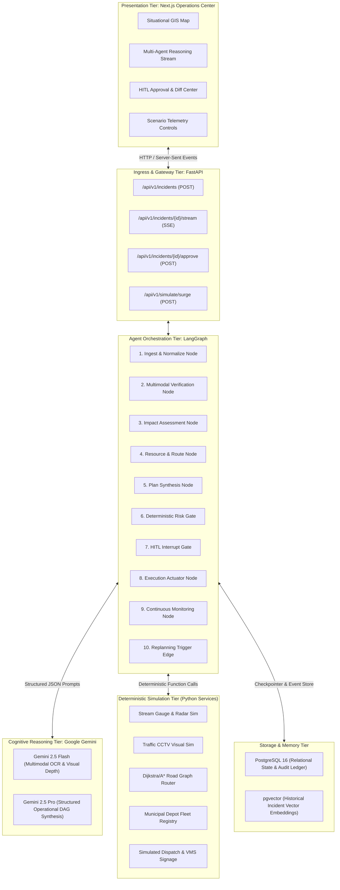
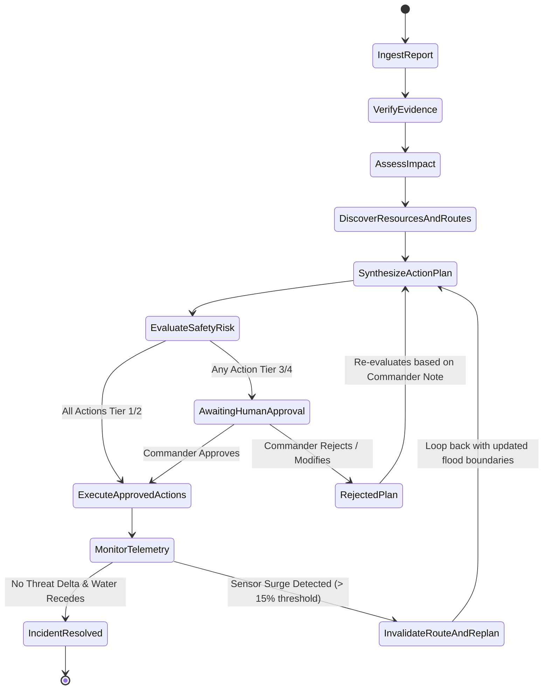
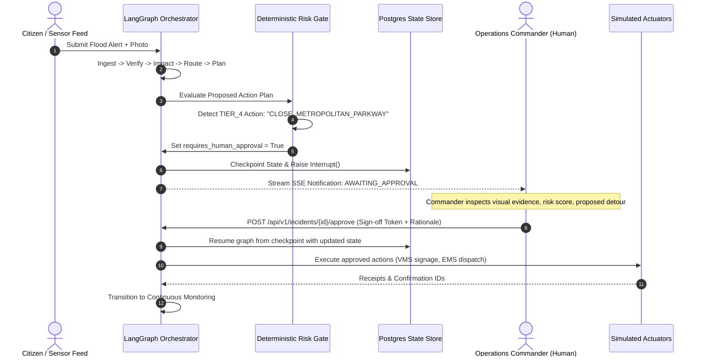

# NEXUS — System Architecture & Technical Design

**Version:** 1.0.0  
**System:** Autonomous Real-World Response & Operations Network  
**Orchestration Engine:** LangGraph (Python)  
**Foundation Model:** Google Gemini via modern `google-genai` SDK  
**State Store & Memory:** PostgreSQL + `pgvector`  
**Frontend Operations UI:** Next.js (TypeScript, Tailwind CSS)

---

## 1. High-Level Architectural Topology

NEXUS decouples **probabilistic reasoning** (multimodal LLM perception, plan narrative generation) from **deterministic control** (graph routing algorithms, safety risk gates, database transactions, execution actuators).



---

## 2. LangGraph State Machine Architecture

### 2.1 State Graph Transition Flow
The operational lifecycle is modeled as a stateful directed acyclic graph with a conditional replanning loop.



### 2.2 Complete Typed State Schema (`NexusIncidentState`)

```python
from typing import TypedDict, List, Dict, Any, Optional, Literal
from pydantic import BaseModel, Field
from datetime import datetime


class GeoPoint(BaseModel):
    latitude: float
    longitude: float
    address_reference: Optional[str] = None


class EvidenceItem(BaseModel):
    evidence_id: str
    source_type: Literal[
        "citizen_photo", "iot_stream_gauge", "traffic_cctv", "historical_vector_match"
    ]
    timestamp: datetime
    data_payload: Dict[str, Any]
    visual_water_depth_inches: Optional[float] = None
    sensor_reading_inches: Optional[float] = None
    confidence_score: float = Field(..., ge=0.0, le=1.0)
    corroborated: bool


class ImpactAssessment(BaseModel):
    critical_facility_name: str
    facility_type: Literal["trauma_hospital", "power_station", "water_treatment", "transit_hub"]
    ingress_cut_off: bool
    estimated_isolation_risk_minutes: int
    severely_affected_corridors: List[str]
    population_density_index: float
    summary_narrative: str


class RouteOption(BaseModel):
    route_id: str
    origin: str
    destination: str
    waypoints: List[List[float]]
    total_distance_km: float
    estimated_transit_time_min: float
    max_water_clearance_supported_inches: float
    is_compromised: bool = False
    compromised_reason: Optional[str] = None


class DispatchedResource(BaseModel):
    unit_id: str
    unit_name: str
    resource_type: str
    assigned_route_id: str
    status: Literal["staged", "en_route", "on_scene"]


class ActionItem(BaseModel):
    action_id: str
    sequence_order: int
    action_type: Literal[
        "UPDATE_VARIABLE_MESSAGE_SIGN",
        "DISPATCH_HIGH_WATER_EMS",
        "DEPLOY_ROAD_BLOCK_BARRIER",
        "NOTIFY_HOSPITAL_TRAUMA_BAY",
        "ACTIVATE_SECONDARY_DETOUR",
        "ISSUE_PUBLIC_TRAVEL_ADVISORY",
    ]
    target_entity: str
    risk_tier: Literal["TIER_1_AUTO", "TIER_2_LOW", "TIER_3_MEDIUM", "TIER_4_HIGH"]
    description: str
    execution_payload: Dict[str, Any]
    approval_required: bool
    approval_status: Literal["PENDING", "APPROVED", "REJECTED", "AUTO_APPROVED"]
    executed: bool = False
    execution_result: Optional[Dict[str, Any]] = None


class AuditRecord(BaseModel):
    record_id: str
    timestamp: datetime
    node_name: str
    actor: Literal[
        "INGESTION_AGENT",
        "VERIFICATION_AGENT",
        "IMPACT_AGENT",
        "PLANNER_AGENT",
        "RISK_GATE",
        "HUMAN_COMMANDER",
        "EXECUTION_AGENT",
        "MONITOR_AGENT",
    ]
    action_summary: str
    state_delta: Dict[str, Any]
    signature_hash: str


class NexusIncidentState(TypedDict):
    incident_id: str
    incident_title: str
    current_status: Literal[
        "INGESTED",
        "VERIFIED",
        "IMPACT_EVALUATED",
        "ROUTED",
        "PLAN_SYNTHESIZED",
        "AWAITING_APPROVAL",
        "EXECUTING",
        "MONITORING",
        "REPLANNING",
        "RESOLVED",
    ]
    raw_user_report: str
    image_attachment_url: Optional[str]
    epicenter_coords: GeoPoint

    # Reasoning & Evidence Artifacts
    extracted_features: Dict[str, Any]
    evidence_trail: List[EvidenceItem]
    verification_confidence: float
    impact_assessment: Optional[ImpactAssessment]

    # Operational Assets & Navigation
    available_fleet: List[Dict[str, Any]]
    active_routes: List[RouteOption]
    selected_primary_route_id: Optional[str]

    # Action Plan & Safety
    action_plan: List[ActionItem]
    requires_human_approval: bool
    commander_decision: Optional[Dict[str, Any]]

    # Sensor Polling & Monitoring
    monitored_sensor_ids: List[str]
    telemetry_surge_detected: bool
    replan_iteration_count: int

    # Audit Trail
    audit_log: List[AuditRecord]
    system_errors: List[str]
```

---

## 3. Human-in-the-Loop (HITL) Gate Architecture

### 3.1 LangGraph Checkpoint & Interrupt Flow
NEXUS uses LangGraph's native interrupt pattern backed by PostgreSQL checkpointers (`AsyncPostgresSaver`).



### 3.2 Human Approval API Contract
```http
POST /api/v1/incidents/{incident_id}/decision
Content-Type: application/json

{
  "reviewer_id": "commander_elena_vance",
  "decision": "APPROVED",
  "reviewed_plan_version": 1,
  "action_overrides": [],
  "rationale": "Cross-verified with Stream Gauge SG-401 showing 32-inch crest. Hospital access compromised. Alternate Route Beta validated for high-clearance ambulances."
}
```

---

## 4. Deterministic vs. Stochastic Boundaries

A core architectural tenet of NEXUS is that **stochastic Large Language Models are never permitted to make life-critical policy or execution decisions**.

| Domain / Function | Mechanism | Rationale |
|---|---|---|
| **Text & Audio Ingestion** | Stochastic (Gemini 2.5 Flash) | Handles noisy, informal, colloquial citizen descriptions and EXIF metadata. |
| **Visual Flood Detection** | Stochastic (Gemini 2.5 Flash Vision) | Estimates visual water markers, submerged tire rims, and debris in CCTV frames. |
| **Plan Narrative Synthesis** | Stochastic (Gemini 2.5 Pro) | Formulates cohesive, context-aware operational steps based on provided structured context. |
| **Risk Classification** | **Strictly Deterministic** | Policy matrix checks action types against hard-coded legal and safety thresholds. Cannot be hallucinated down. |
| **Road Graph Routing** | **Strictly Deterministic** | Dijkstra/A* graph algorithm calculates absolute shortest safe traversal over topological road nodes. |
| **Resource Inventory Match** | **Strictly Deterministic** | SQL filter on vehicle axle height, equipment availability, and spatial distance. |
| **Actuator Dispatch** | **Strictly Deterministic** | Validates signed approval token and fires typed API requests to simulated municipal services. |
| **Surge Delta Detection** | **Strictly Deterministic** | Mathematical delta comparison: `(current_water_level - baseline_level) > delta_threshold`. |

---

## 5. Simulation Engine Design

To ensure safe, realistic demonstration without interfacing with actual 911 dispatch lines, NEXUS incorporates an internal simulation engine:

### 5.1 Simulated Road Graph Network (`services/simulation/road_network.py`)
- Modeled as a directed graph representing the district surrounding *St. Jude Memorial Hospital*.
- Nodes:
  - `NODE_DEPOT_CENTRAL`: Fire & Rescue Fleet Depot (Origin)
  - `NODE_RIVER_CROSSING`: Metropolitan Parkway at River Road (Epicenter)
  - `NODE_HOSPITAL_ER`: St. Jude Memorial Ambulance Bay (Destination)
  - `NODE_NORTH_RIDGE`: Route Alpha bypass node (High elevation, narrow lanes)
  - `NODE_SOUTH_BYPASS`: Route Beta bypass node (Industrial corridor, high clearance)
  - `NODE_EAST_EXPRESSWAY`: Route Gamma backup artery
- Edges contain physical properties: `length_meters`, `normal_speed_limit`, `flood_level_inches`, `max_supported_water_clearance_inches`.

### 5.2 Dynamic Scenario Controller (`services/simulation/scenario_controller.py`)
- Provides API hooks to inject real-world chaos during the live hackathon demonstration:
  1. `POST /api/v1/simulate/initial_flood`: Sets River Crossing flood depth to 28 inches (blocking passenger cars and standard EMS).
  2. `POST /api/v1/simulate/water_surge`: Increases water level by +18 inches along South Bypass (invalidating Route Beta and forcing automated replanning to Route Alpha/Gamma).
  3. `POST /api/v1/simulate/tool_failure`: Injects artificial latency or HTTP 500 into CCTV camera feeds to demonstrate fallback to sensor gauges and historical vector memory.

---

## 6. Telemetry, Auditability, and Ledger Design

Every state mutation generates an immutable `AuditRecord` containing:
1. `record_id`: UUIDv4
2. `timestamp`: ISO-8601 UTC
3. `incident_id`: Foreign key
4. `actor`: Agent ID or Human Commander ID
5. `action_name`: e.g. `RISK_EVALUATED`, `HITL_APPROVAL_GRANTED`, `TOOL_DISPATCH_SUCCESS`
6. `state_diff`: Key-value delta of state variables modified
7. `signature_hash`: Cryptographic SHA-256 hash chaining back to the previous record (`hash(prev_hash + record_payload)`) to guarantee tamper-evidence for post-incident judicial reviews.

---

## 7. Frontend Operations Center Architecture

### 7.1 Architecture
The user interface is built as a single-page reactive command dashboard in **Next.js 15 (App Router)** with **Tailwind CSS** and **Lucide Icons**:

1. **Top Status Ribbon:** Incident status badge, live UTC operations clock, active replan iteration counter, and sensor alert ticker.
2. **Left Panel: Situational Geospatial Map:**
   - Real-time road network visualization.
   - Flood depth heatmaps and hazard circles.
   - Live location of staged and en-route emergency units.
   - Colored route lines (Red = Submerged/Compromised, Yellow = Caution, Green = Safe Approved Route).
3. **Center Panel: Multi-Agent Reasoning & Evidence Trace:**
   - Real-time collapsible reasoning stream displaying each agent's internal thought steps, tool queries, and raw evidence cards (IoT telemetry, CCTV snapshots).
4. **Right Panel: Action Plan & Human Approval Center:**
   - Visual DAG of proposed operational interventions.
   - Risk classification badges (Tier 1 green, Tier 2 blue, Tier 3 yellow, Tier 4 red).
   - Structured Approve / Reject controls with mandatory rationale text box.
   - Real-time simulation control buttons to trigger cloudbursts and replans live in front of the hackathon jury.
